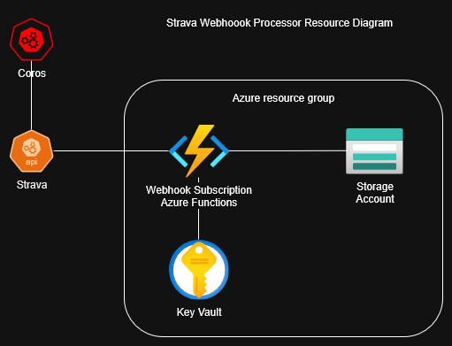
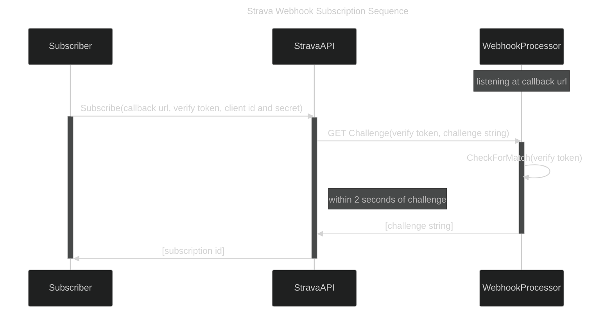
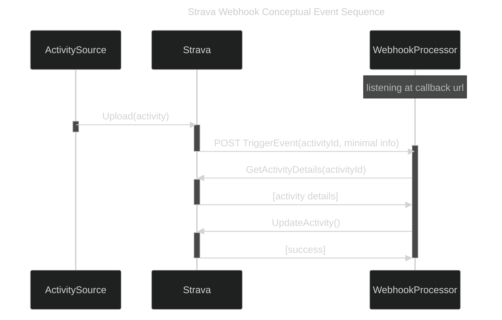
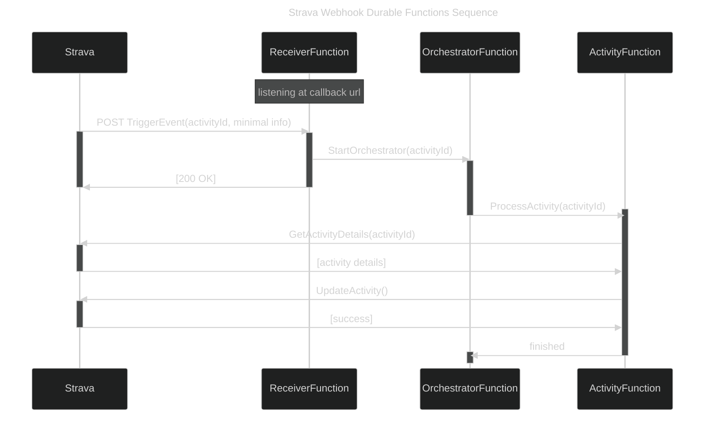

# StravaWebhookProcessor

A service to process events from [Strava Webhooks](https://developers.strava.com/docs/webhooks/), written in C# with Azure Functions.

As of now, this only works with one athlete. But for me that is fine since I'm only doing things to my own activities.

## Applications

I use this to automatically edit and augment basic properties of activities:

- Add extra weather info. Strava adds some info standardly, but I add more:
  - Dew point
  - Weather at start AND end time, or also middle time for really long activities
- "hide from feed" certain activities that are spammy (short strength training sessions, walks)
- Flag treadmill activities to-be-refined since I use a separate app to augment and re-upload them (they automatically upload from my watch)

## Prerequisites

The webhooks are subscribed to by your "API application", kind of like your access policy to use the Strava API.

They describe how to create an API app here: https://developers.strava.com/docs/getting-started/#account

## Technologies / references

Custom libraries:

- [Strava Utilities](https://github.com/LoganTretter/StravaUtilities) for a client to interface with the Strava API

Standard tools:

- [Azure Functions](https://learn.microsoft.com/en-us/azure/azure-functions/) for serverless cloud hosted service
  - [Developer guide (C#)](https://learn.microsoft.com/en-us/azure/azure-functions/functions-reference?pivots=programming-language-csharp)
    - [Local development resources](https://learn.microsoft.com/en-us/azure/azure-functions/functions-develop-local?pivots=programming-language-csharp)
  - [.NET isolated process guide](https://learn.microsoft.com/en-us/azure/azure-functions/dotnet-isolated-process-guide)
    - [Dependency injection](https://learn.microsoft.com/en-us/azure/azure-functions/functions-develop-local?pivots=programming-language-csharp)
  - [Durable Functions](https://learn.microsoft.com/en-us/azure/azure-functions/durable/) to handle long-running process
    - [Async HTTP API pattern](https://learn.microsoft.com/en-us/azure/azure-functions/durable/durable-functions-overview?tabs=isolated-process%2Cnodejs-v3%2Cv1-model&pivots=csharp#async-http)
    - [HTTP Trigger](https://learn.microsoft.com/en-us/azure/azure-functions/functions-bindings-http-webhook-trigger?tabs=python-v2%2Cisolated-process%2Cnodejs-v4%2Cfunctionsv2&pivots=programming-language-csharp)
- [Azure Key Vault](https://learn.microsoft.com/en-us/azure/key-vault/general/) for storing Strava API access token
  - [SecretClient](https://learn.microsoft.com/en-us/dotnet/api/overview/azure/security.keyvault.secrets-readme?view=azure-dotnet) for interfacing with vault

## Azure resources

This is built as an Azure Functions project, but fairly simple.
I chose Azure Functions because I wanted something cheap, serverless, and something where I didn't need to manage the infrastructure.

The couple pieces of complexity come from:

- The need to keep track of the token. I use an Azure Key Vault for this, since it is secure and cheap.
- The need to respond quickly to events. I use Azure Durable Functions for this. This creates the need for a storage account.

## Implementation details

The [StravaWebhookProcessorFunctions](src/StravaWebhookProcessor/StravaWebhookProcessorFunctions.cs) class can be seen as the "mechanism" or "coordinator" for handling the events (and the initial subscription). You could implement this project and mostly leave that as-is.

But the real effect of using the webhooks is - what do you want to do with each event? That's where you would probably want to implement your own processing.

To separate those concerns, the functions call into a separate event processor, through the [IStravaWebhookEventProcessor](src/StravaWebhookProcessor/IStravaWebhookEventProcessor.cs) interface.
I have my own implementation of this ([StravaWebhookEventProcessor](src/StravaWebhookProcessor/StravaWebhookEventProcessor.cs)) to do what I want with each event (as noted in [Applications](#Applications)), but you can write your own implementation to do whatever you want. Update [Program.cs](src/StravaWebhookProcessor/Program.cs), use dependency injection to add your implementation (along with its own depenencies as needed).

## Explanation of concepts and processes

### Subscribing to the webhooks

Before the processor can receive events for any activities, webhooks must be subscribed to.

And, Strava uses the same URL to both confirm a subscription and to push events to. Because of that, this function app is built to have one HTTP-triggered function, that can be called with a GET or a POST, and that one function handles both the subscription and the actual events.

They describe the process of subscribing in [their guide](https://developers.strava.com/docs/webhooks/), but here is a summarized version too.

- You need the webhook processor to be up and running
- The processor needs two endpoints, a GET and a POST, but the same URL
- Either manually or by some other means, you need to make a call to the Strava API to request the subscription
- Strava will call the GET on the processor with a "challenge" string, and the GET needs to echo back that string within 2 seconds
- If successful, then the subscription is active and events will be pushed to the processor's POST endpoint; they'll give the subscription id that you can use to validate each event, or use it to unsubscribe

### Processing the webhook events

Once the app is subscribed, the URL provided will receive events for all athletes that have authorized the app.

The basic flow is a normal event-based process, like so:

- Something uploads or updates an activity to Strava
- Strava pushes an event to the subscribing process, but only with minimal info, but importantly the activity id and the type of event (add / edit / delete)
- The process calls back to get more info
- The process makes its mutating call

A little more specifically, this uses Azure Durable Functions as a means to defer the full processing to a separate process, in order to reply to the Strava Webhook quickly (as they state they need a response to "the POST of each new event with a status code of 200 OK within two seconds"). Normally with this strategy the receiver would reply with 202 accepted, but since they specifically say 200, it does that instead. This is the [Async HTTP API Pattern](https://learn.microsoft.com/en-us/azure/azure-functions/durable/durable-functions-overview?tabs=isolated-process%2Cnodejs-v3%2Cv1-model&pivots=csharp#async-http).

- A "receiver" function serves as the HTTP endpoint to be called. It just receives the call, does a bit of quick validation of the input, triggers the deferred process, and replies to the caller
- An "orchestrator" function coordinates the deferred process, it just triggers the one actual processor function
- An "activity" function contains the actual processing of the event
  - This uses the [Strava Utilities](https://github.com/LoganTretter/StravaUtilities) library to make calls to the Strava API

